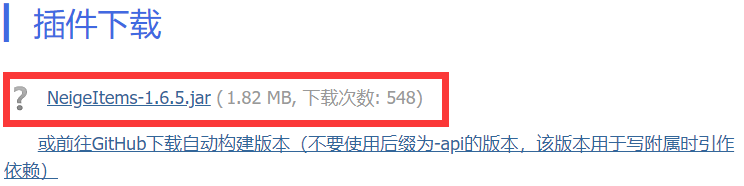
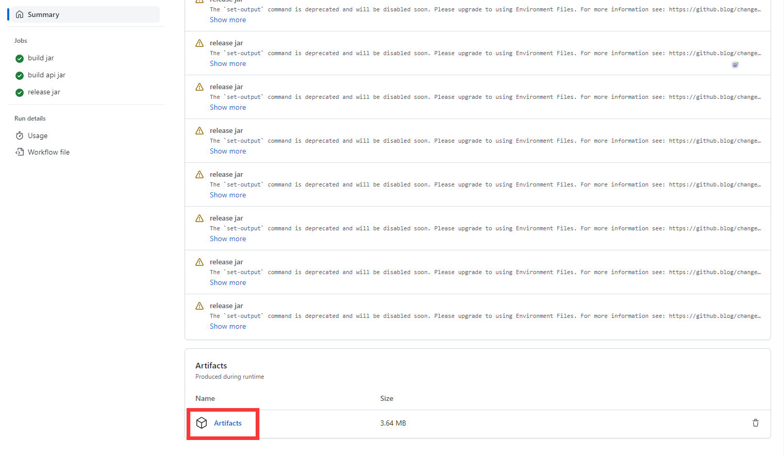
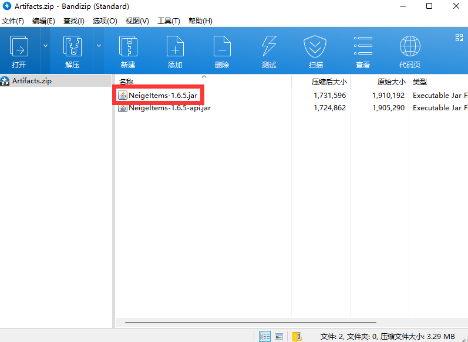
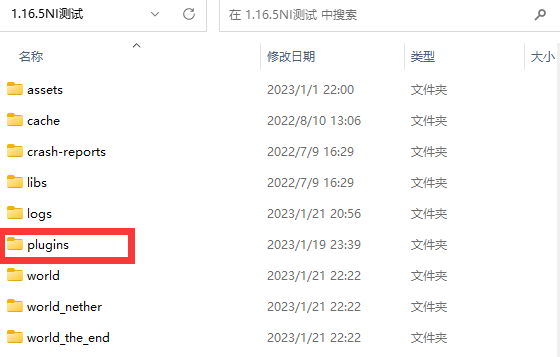
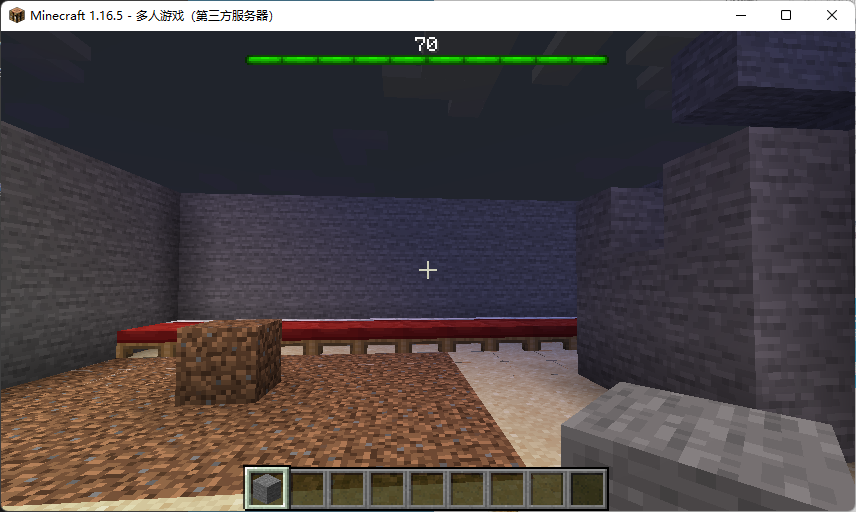
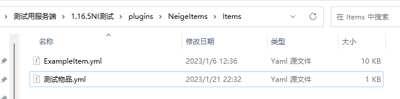
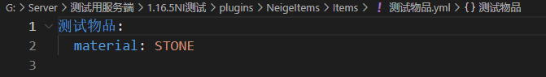
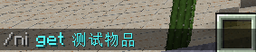
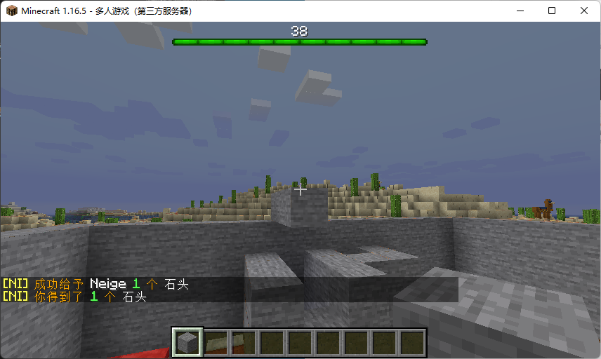

# 没头脑篇

没头脑篇对应没有大脑的人，在本节中，我将尽可能将过程详细描述，并辅以图片帮助理解，以尽量写出你能看懂的文字。

## 插件下载

你有三种选择下载到NeigeItems.jar文件：

### MCBBS插件贴

前往本插件的[MCBBS插件贴](https://www.mcbbs.net/thread-1364195-1-1.html)，往下翻，翻到“插件下载”部分，下载里面的NeigeItems-版本.jar文件。其中“版本”代表当时的插件版本。比如本节wiki书写时，最新版本为1.6.5，你就应该下载NeigeItems-1.6.5.jar文件。别寄吧问我为什么没找到叫“NeigeItems-版本.jar”的文件，只看到了一个什么“NeigeItems-1.X.X.jar”，你敢问你就他妈的命不久矣。为防止观看者找不到“插件下载”部分，说我没提供，我在此截图：

画红框的部分就是你要下载的文件

### Github自动构建

前往[Github自动构建](https://github.com/Neige7/NeigeItems-Kotlin/actions)下载。首先，你需要登录Github账号。不登录Github账号是下载不了自动构建的。别寄吧问我Github怎么注册，这是NeigeItems的wiki，不是他妈Github的wiki。下面，我将通过图片展示自动构建页面：

画红框的部分，即最上面一条自动构建，就是我们的目标。将鼠标移动到文字上后，我们会惊讶地发现，这行文字可以点击：

点击进入最新的自动构建，我们将看到如下界面：

此时你可能会问：你妈的，花花绿绿，我要下载的插件在哪里？这页面这么花，插件作者的人品一定有问题。但是，你先别急，让我先急。动动你的鼠标滚轮，翻到页面的最下面：

看到红框中的“Artifacts”了吗？点击他，你就可以开始下载自动构建了。你将通过下载得到Artifacts.zip文件，使用解压软件打开，你可以看到：

你需要的就是这个“NeigeItems-1.6.5.jar”。别jb用那个“NeigeItems-1.6.5-api.jar”，这玩意儿没有经过重定向，是用来在写插件的时候引作依赖的。

### Github Releases

前往[Github Releases](https://github.com/Neige7/NeigeItems-Kotlin/releases)下载。为防止有人不知道怎么下载自动构建，从1.6.2版本开始，NeigeItems会自动将自动构建发布为Release。Releases中的附件不会过期，且可以直接下载。下面看图：

红框中的“NeigeItems-1.6.5.jar”就是你需要的文件，别jb问我那个带-api的东西是什么，那是写插件的时候用来当依赖引用的。

### 无法下载？

#### 我没有BBS账号/我的BBS账号等于小于3

没有MCBBS账号/MCBBS账号等级小于3会导致你下载的附件变为51KB大小的空文件，这种文件显然是不能正常当做插件使用的。对此我的建议是：创建一个MCBBS账号，然后慢慢升到3级以上。别jb再在这个问题上继续纠缠，除非你命不久矣，最后的遗愿是下载到NeigeItems.jar

#### 我的网络环境无法连接到Github

对此我提供四种解决方案：
* 通过MCBBS下载
* 前往国外旅游，连接国外网络后登录Github下载
* 通过武林绝学连接国外网络后登录Github下载
* 欲练神功，必先自宫。自宫后口含内存条通过脑电波下载

## 服务端需求

NeigeItems基于BukkitAPI编写，因此你需要在拥有BukkitAPI的服务端上使用本插件。至本段wiki撰写时，以下服务端通过了用户测试：
* paper1.12.2-1.19.3
* arclight1.16.5
* spigot1.12.2
* catserver1.12.2

其中：catserver需要使用较新的版本，旧版本catserver可能导致插件无法加载。

:::info

不在此列表的bukkit服务端不一定不能使用NeigeItems，你可以亲自尝试，下一节，我将介绍NeigeItems的安装。

:::

## 插件安装

本节中，我将以paper-1.16.5-794为例，介绍NeigeItems的安装。对于bukkit服务端，插件安装过程都是一样的，此案例适用于绝大多数插件。

### 关闭服务端

安装插件前，你应该关闭服务端。所有热加载插件的行为均无法保证插件运行稳定性。热加载插件后反馈插件无法运行的人应该被塞到马桶里溺死。同时我在此建议：卸载你服务器中的YUM，这是狗屎插件一个。

### 放置插件

打开你的服务端根目录，你可以看到一系列文件夹，请注意其中的“plugins”文件夹：

将你的NeigeItems.jar文件放入该文件夹。

### 开启服务端

开启服务端，NeigeItems理应正常加载。如果你遵照这三步安装NeigeItems遇到了插件不加载的情况，你可以[加入QQ群](https://jq.qq.com/?_wv=1027&k=Af21TU4j)，将logs文件夹中的日志文件发给群主Neige。Neige会根据你的服务器日志判断出现了什么错误。

## 我的第一个物品

为照顾各个智商层次的人类（或者其他生物？），我将通过物品保存指令演示生成你的第一个物品配置。
现在，进入服务器，确保你是服务器OP，手持一个物品：

输入指令：`/ni save 测试物品`

我们可以看到，聊天框出现了以下文本：

现在打开服务端根目录，查看`plugins/NeigeItems/Items`文件夹：

我们可以看到，生成了`测试物品.yml`文件，因为我们没有指定物品保存路径，所以文件以物品ID命名。

相关内容可以查看[物品保存指令](指令/物品保存.md)。

现在我们打开`测试物品.yml`：

我们可以看到，我手中的石头成功保存了。

其中的`STONE`，就是石头对应的材质ID。你可以通过`/ni save`指令，得知所有物品的对应ID（包括mod物品）

其中的`测试物品`代表`物品ID`为测试物品，`material: STONE`代表该物品的`材质`为`石头`。

如果你想要编辑物品lore、附魔等属性，请查看[物品配置](物品/物品配置/配置项.md)

当然，你也可以在游戏内做出拥有相关属性的物品，然后通过`/ni save`将其保存，从而得知相关属性配置的编写方法，正如你得知material代表材质一样。

## 获取/给予物品

上一节中我们提到：其中的`测试物品`代表`物品ID`为测试物品

现在我们输入指令：`/ni get 测试物品`：

我们可以看到：

我们成功获取了`测试物品`。

你可以查看[物品获取](指令/物品获取.md)了解get、give、giveAll的用法。

类似的，`/ni give Neige 测试物品`代表给予Neige一个测试物品。
