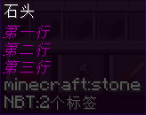
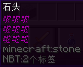
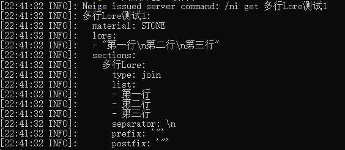
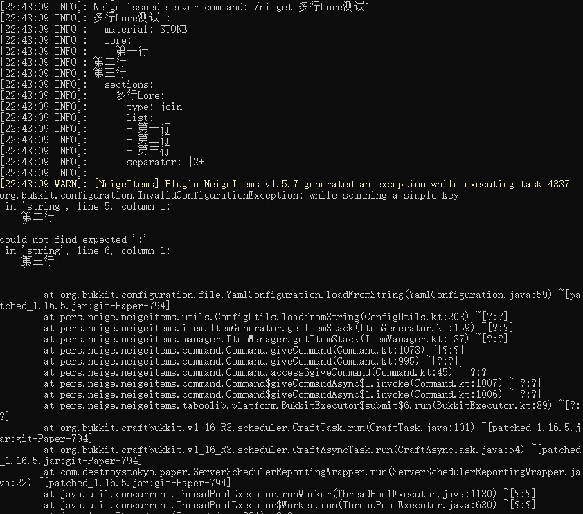

# 通过节点插入多行Lore

## 方法1

```yaml
多行Lore测试1:
  material: STONE
  lore:
  - <多行Lore>
  sections:
    多行Lore:
      type: join
      list:
        - 第一行
        - 第二行
        - 第三行
      separator: "\\n"
      prefix: '"'
      postfix: '"'
```



## 方法2

```yaml
多行Lore测试2:
  material: STONE
  lore:
  - <多行Lore>
  sections:
    多行Lore: '"第一行\n第二行\n第三行"'
```


## 方法3

```yaml
多行Lore测试3:
  material: STONE
  lore:
  - <多行Lore>
  sections:
    多行Lore:
      type: repeat
      content: 啦啦啦
      repeat: 3
      separator: "\\n"
      prefix: '"'
      postfix: '"'
```



## 值得一提

:::caution

本段内容较为复杂，如果你没有打破砂锅问到底的闲心，请跳过本部分

:::

:::info

> 提问: 根据你写的配置，以方法1为例，`多行Lore`这一节点的返回值应该为`"第一行\\n第二行\\n第三行"`。你为什么要在两边加上双引号?你为什么要使用`"\\n"`？根据yaml语法，`"\\n"`应该代表形似`\n`的字符, `"\n"`才是换行符，你在搞什么，为什么最后这段配置运行正常？我想打死你:)

> 回答: 世界比你想象的更加复杂，你先别急，让我先急:)

首先, `多行Lore`这一节点的返回值不是`"第一行\\n第二行\\n第三行"`，而是`"第一行\n第二行\n第三行"`。

对于这个join节点，节点返回值应该为`前缀`+`列表的第一项`+`分隔符`+`列表的第二项`+`分隔符`+`列表的第三项`+`后缀`。

这个过程是拼接出来的。所以`"\\n"`作为字符体现为`\n`

故结果为`"第一行\n第二行\n第三行"`

下面我来解释一下不在两边加上双引号，并直接用换行符做separator会发生什么

替换前:
```yaml
多行Lore测试1:
  material: STONE
  lore:
  - <多行Lore>
```
替换后:
```yaml
多行Lore测试1:
  material: STONE
  lore:
  - 第一行
第二行
第三行
```

是的，换行符不会以换行符形式出现，会真的换行（微笑）

所以我们需要形似`"第一行\n第二行\n第三行"`的返回值

替换后:
```yaml
多行Lore测试1:
  material: STONE
  lore:
  - "第一行\n第二行\n第三行"
```

读取后刚好是正确的格式

> 提问: 我花一年时间理解了你上面那个屌问题。这种狗东西你怎么写出来的，脑测吗？

> 回答：请善用debug。将`plugin/NeigeItems/config.yml`中的`Main.Debug`设置为true即可开启debug模式。

开启后效果见下图



:::

:::caution

错误示范见下图



:::