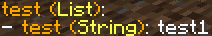
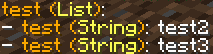

# 函数类型

> 动作ID不区分大小写

## 材质

> 给物品设置材质

函数ID: `setMaterial`

函数参数: `材质的Bukkit英文ID`

参数示例: `STONE`

示例解析: `待设置物品材质将变为石头`

:::info

所有ID可查看: https://hub.spigotmc.org/javadocs/spigot/org/bukkit/Material.html

但Neige更加推荐: 使用`/ni save`指令保存对应物品, 然后前往物品配置查看material

:::

## 材质(解析papi变量)

> 给物品设置材质

函数ID: `setMaterialPapi`

函数参数: `材质的Bukkit英文ID`

参数示例: `%player_name%`

示例解析: `如果你的ID是STONE, 那么待设置物品材质将变为石头`

:::info

很明显, 解析papi变量会消耗额外的性能, 所以没有特殊需求可以使用`setMaterial`函数

:::

## 材质(解析动作变量)

> 给物品设置材质

函数ID: `setMaterialSection`

函数参数: `材质的Bukkit英文ID`

参数示例: `<strings::STONE_SUGAR>`

示例解析: `待设置物品将随机变为石头或糖`

:::info

很明显, 解析随机节点会消耗更多的性能, 所以没有特殊需求可以使用`setMaterial`或`setMaterialPapi`函数

当前函数中的papi变量可以通过<papi::变量内容>表示, 形如<papi::player_name>

:::

## 设置数量

> 给物品设置数量

函数ID: `setAmount`

函数参数: `目标数量`

参数示例: `1`

示例解析: `待设置物品数量将变为1`

:::info

目标数量无法超过物品最大堆叠数, 无法小于0, 等于0将销毁物品

:::

## 设置数量(解析papi变量)

> 给物品设置数量

函数ID: `setAmountPapi`

函数参数: `目标数量`

参数示例: `%player_level%`

示例解析: `假设我的等级是10, 那么待设置物品数量将变为10`

:::info

目标数量无法超过物品最大堆叠数, 无法小于0, 等于0将销毁物品

:::

## 设置数量(解析动作变量)

> 给物品设置数量

函数ID: `setAmountSection`

函数参数: `目标数量`

参数示例: `<number::1_10>`

示例解析: `待设置物品数量将随机变为1-10`

:::info

目标数量无法超过物品最大堆叠数, 无法小于0, 等于0将销毁物品

:::

## 添加数量

> 给物品添加数量

函数ID: `addAmount`

函数参数: `添加数量`

参数示例: `1`

示例解析: `待设置物品数量将增加1`

:::info

目标数量无法超过物品最大堆叠数, 无法小于0, 等于0将销毁物品

这只影响当前物品, 不会对玩家背包其他物品造成影响, `addAmount`一万不会给予玩家10000个物品, 只会让当前物品达到堆叠上限

:::

## 添加数量(解析papi变量)

> 给物品添加数量

函数ID: `addAmountPapi`

函数参数: `添加数量`

参数示例: `%player_level%`

示例解析: `假设我的等级是10, 那么待设置物品数量将增加10`

:::info

目标数量无法超过物品最大堆叠数, 无法小于0, 等于0将销毁物品

这只影响当前物品, 不会对玩家背包其他物品造成影响, `addAmount`一万不会给予玩家10000个物品, 只会让当前物品达到堆叠上限

:::

## 添加数量(解析动作变量)

> 给物品添加数量

函数ID: `addAmountSection`

函数参数: `添加数量`

参数示例: `<number::1_10>`

示例解析: `待设置物品数量将随机增加1-10`

:::info

目标数量无法超过物品最大堆叠数, 无法小于0, 等于0将销毁物品

这只影响当前物品, 不会对玩家背包其他物品造成影响, `addAmount`一万不会给予玩家10000个物品, 只会让当前物品达到堆叠上限

:::

## 扣除数量

> 给物品扣除数量

函数ID: `takeAmount`

函数参数: `扣除数量`

参数示例: `1`

示例解析: `待设置物品数量将减少1`

:::info

目标数量无法超过物品最大堆叠数, 无法小于0, 等于0将销毁物品

这只影响当前物品, 不会对玩家背包其他物品造成影响, `takeAmount`一万不会扣除玩家背包所有物品, 只会让当前物品消失

:::

## 扣除数量(解析papi变量)

> 给物品扣除数量

函数ID: `takeAmountPapi`

函数参数: `扣除数量`

参数示例: `%player_level%`

示例解析: `假设我的等级是10, 那么待设置物品数量将减少10`

:::info

目标数量无法超过物品最大堆叠数, 无法小于0, 等于0将销毁物品

这只影响当前物品, 不会对玩家背包其他物品造成影响, `takeAmount`一万不会扣除玩家背包所有物品, 只会让当前物品消失

:::

## 扣除数量(解析动作变量)

> 给物品扣除数量

函数ID: `takeAmountSection`

函数参数: `扣除数量`

参数示例: `<number::1_10>`

示例解析: `待设置物品数量将随机减少1-10`

:::info

目标数量无法超过物品最大堆叠数, 无法小于0, 等于0将销毁物品

这只影响当前物品, 不会对玩家背包其他物品造成影响, `takeAmount`一万不会扣除玩家背包所有物品, 只会让当前物品消失

:::

## 显示名

> 给物品设置显示名称

函数ID: `setName`

函数参数: `待设置显示名称`

参数示例: `&e测试物品`

示例解析: `待设置物品的显示名称将变为§e测试物品`

:::info

文本中的&将被自动替换为颜色符号§

:::

## 显示名(解析papi变量)

> 给物品设置显示名称

函数ID: `setNamePapi`

函数参数: `待设置显示名称`

参数示例: `&e%player_name%`

示例解析: `我的玩家ID是Neige, 所以待设置物品的显示名称将变为§eNeige`

:::info

文本中的&将被自动替换为颜色符号§

:::

## 显示名(解析动作变量)

> 给物品设置显示名称

函数ID: `setNameSection`

函数参数: `待设置显示名称`

参数示例: `&e<strings::测试物品1_测试物品2>`

示例解析: `待设置物品的显示名称将变为§e测试物品1或§e测试物品2`

:::info

文本中的&将被自动替换为颜色符号§

:::

## 显示名前缀

> 为物品显示名称添加前缀

函数ID: `addNamePrefix`

函数参数: `待添加前缀`

参数示例: `&4史诗-`

示例解析: `假设原先物品的显示名为§e测试物品, 函数执行后将变为§4史诗-§e测试物品`

:::info

文本中的&将被自动替换为颜色符号§

:::

## 显示名前缀(解析papi变量)

> 为物品显示名称添加前缀

函数ID: `addNamePrefixPapi`

函数参数: `待添加前缀`

参数示例: `&4%player_name%的-`

示例解析: `我的玩家ID是Neige, 假设原先物品的显示名为§e测试物品, 那么物品的显示名称将变为§4Neige的-§e测试物品`

:::info

文本中的&将被自动替换为颜色符号§

:::

## 显示名前缀(解析动作变量)

> 为物品显示名称添加前缀

函数ID: `addNamePrefixSection`

函数参数: `待添加前缀`

参数示例: `&e<strings::&4史诗-_&f垃圾->`

示例解析: `假设原先物品的显示名为§e测试物品, 函数执行后将随机变为&4史诗-§e测试物品或&f垃圾-§e测试物品`

:::info

文本中的&将被自动替换为颜色符号§

:::

## 显示名后缀

> 为物品显示名称添加后缀

函数ID: `addNamePostfix`

函数参数: `待添加后缀`

参数示例: `-后缀`

示例解析: `假设原先物品的显示名为§e测试物品, 函数执行后将变为§e测试物品-后缀`

:::info

文本中的&将被自动替换为颜色符号§

:::

## 显示名后缀(解析papi变量)

> 为物品显示名称添加后缀

函数ID: `addNamePostfixPapi`

函数参数: `待添加后缀`

参数示例: `-%player_name%`

示例解析: `我的玩家ID是Neige, 假设原先物品的显示名为§e测试物品, 那么物品的显示名称将变为§e测试物品-Neige`

:::info

文本中的&将被自动替换为颜色符号§

:::

## 显示名后缀(解析动作变量)

> 为物品显示名称添加后缀

函数ID: `addNamePostfixSection`

函数参数: `待添加后缀`

参数示例: `&e<strings::-后缀1_-后缀2>`

示例解析: `假设原先物品的显示名为§e测试物品, 函数执行后将随机变为§e测试物品-后缀1或§e测试物品-后缀2`

:::info

文本中的&将被自动替换为颜色符号§

:::

## 替换显示名(替换一次)

> 替换物品显示名中的对应文本(只替换一次)

函数ID: `replaceName`

函数参数: `json形式的"待替换文本":"替换文本"`

参数示例: `{"A":"B","C":"D"}`

示例解析: `假设物品原先名为"AACC", 替换后将变为"BADC"`

:::info

文本中的&将被自动替换为颜色符号§

:::

## 替换显示名(替换一次, 解析papi变量)

> 替换物品显示名中的对应文本(只替换一次)

函数ID: `replaceNamePapi`

函数参数: `json形式的"待替换文本":"替换文本"`

参数示例: `{"玩家名":"%player_name%"}`

示例解析: `假设物品原先名为"玩家名的物品", 我的玩家ID是Neige, 替换后名称将变为"Neige的物品"`

:::info

文本中的&将被自动替换为颜色符号§

:::

## 替换显示名(替换一次, 解析动作变量)

> 替换物品显示名中的对应文本(只替换一次)

函数ID: `replaceNameSection`

函数参数: `json形式的"待替换文本":"替换文本"`

参数示例: `{"品质":"<strings::普通_精良>"}`

示例解析: `假设物品原先名为"品质 长剑", 替换后名称将随机变为"普通 长剑"或"精良 长剑"`

:::info

文本中的&将被自动替换为颜色符号§

:::

## 替换显示名(替换全部)

> 替换物品显示名中的对应文本(替换全部)

函数ID: `replaceAllName`

函数参数: `json形式的"待替换文本":"替换文本"`

参数示例: `{"A":"B","C":"D"}`

示例解析: `假设物品原先名为"AACC", 替换后将变为"BBDD"`

:::info

文本中的&将被自动替换为颜色符号§

:::

## 替换显示名(替换全部, 解析papi变量)

> 替换物品显示名中的对应文本(替换全部)

函数ID: `replaceAllNamePapi`

函数参数: `json形式的"待替换文本":"替换文本"`

参数示例: `{"玩家名":"%player_name%"}`

示例解析: `假设物品原先名为"玩家名的物品", 我的玩家ID是Neige, 替换后名称将变为"Neige的物品"`

:::info

文本中的&将被自动替换为颜色符号§

:::

## 替换显示名(替换全部, 解析动作变量)

> 替换物品显示名中的对应文本(替换全部)

函数ID: `replaceAllNameSection`

函数参数: `json形式的"待替换文本":"替换文本"`

参数示例: `{"品质":"<strings::普通_精良>"}`

示例解析: `假设物品原先名为"品质 长剑", 替换后名称将随机变为"普通 长剑"或"精良 长剑"`

:::info

文本中的&将被自动替换为颜色符号§

:::

## 替换显示名(使用正则, 替换一次)

> 替换物品显示名中的对应文本(只替换一次)

函数ID: `replaceNameRegex`

函数参数: `json形式的"正则表达式":"替换文本"`

参数示例: `{"\\d+":"不准写数字"}`

示例解析: `假设物品原先名为"114514", 替换后将变为"不准写数字"`

:::info

文本中的&将被自动替换为颜色符号§, $+索引表示组的调用

$0代表匹配值全文, $1代表第一个组的返回值, 以此类推

你看不懂上面那行字说明你需要学习正则表达式: [跟着海螺学正则](https://www.mcbbs.net/thread-827651-1-1.html)

:::

## 替换显示名(使用正则, 替换一次, 解析papi变量)

> 替换物品显示名中的对应文本(只替换一次)

函数ID: `replaceNameRegexPapi`

函数参数: `json形式的"正则表达式":"替换文本"`

参数示例: `{"(强化等级: )(\\d+)":"$1%math_0:0_$2+1%"}`

示例解析: `假设物品原先名为"强化等级: 1", 替换后名称将变为"强化等级: 2"`

:::info

文本中的&将被自动替换为颜色符号§, $+索引表示组的调用

$0代表匹配值全文, $1代表第一个组的返回值, 以此类推

你看不懂上面那行字说明你需要学习正则表达式: [跟着海螺学正则](https://www.mcbbs.net/thread-827651-1-1.html)

:::

## 替换显示名(使用正则, 替换一次, 解析动作变量)

> 替换物品显示名中的对应文本(只替换一次)

函数ID: `replaceNameRegexSection`

函数参数: `json形式的"正则表达式":"替换文本"`

参数示例: `{"(强化等级: )(\\d+)":"$1<calculation::$2+1>"}`

示例解析: `假设物品原先名为"强化等级: 1", 替换后名称将变为"强化等级: 2"`

:::info

文本中的&将被自动替换为颜色符号§, $+索引表示组的调用

$0代表匹配值全文, $1代表第一个组的返回值, 以此类推

你看不懂上面那行字说明你需要学习正则表达式: [跟着海螺学正则](https://www.mcbbs.net/thread-827651-1-1.html)

:::

## 替换显示名(使用正则, 替换全部)

> 替换物品显示名中的对应文本(替换全部)

函数ID: `replaceAllNameRegex`

函数参数: `json形式的"正则表达式":"替换文本"`

参数示例: `{"\\d+":"不准写数字"}`

示例解析: `假设物品原先名为"114514", 替换后将变为"不准写数字"`

:::info

文本中的&将被自动替换为颜色符号§, $+索引表示组的调用

$0代表匹配值全文, $1代表第一个组的返回值, 以此类推

你看不懂上面那行字说明你需要学习正则表达式: [跟着海螺学正则](https://www.mcbbs.net/thread-827651-1-1.html)

:::

## 替换显示名(使用正则, 替换全部, 解析papi变量)

> 替换物品显示名中的对应文本(替换全部)

函数ID: `replaceAllNameRegexPapi`

函数参数: `json形式的"正则表达式":"替换文本"`

参数示例: `{"(强化等级: )(\\d+)":"$1%math_0:0_$2+1%"}`

示例解析: `假设物品原先名为"强化等级: 1", 替换后名称将变为"强化等级: 2"`

:::info

文本中的&将被自动替换为颜色符号§, $+索引表示组的调用

$0代表匹配值全文, $1代表第一个组的返回值, 以此类推

你看不懂上面那行字说明你需要学习正则表达式: [跟着海螺学正则](https://www.mcbbs.net/thread-827651-1-1.html)

:::

## 替换显示名(使用正则, 替换全部, 解析动作变量)

> 替换物品显示名中的对应文本(替换全部)

函数ID: `replaceAllNameRegexSection`

函数参数: `json形式的"正则表达式":"替换文本"`

参数示例: `{"(强化等级: )(\\d+)":"$1<calculation::$2+1>"}`

示例解析: `假设物品原先名为"强化等级: 1", 替换后名称将变为"强化等级: 2"`

:::info

文本中的&将被自动替换为颜色符号§, $+索引表示组的调用

$0代表匹配值全文, $1代表第一个组的返回值, 以此类推

你看不懂上面那行字说明你需要学习正则表达式: [跟着海螺学正则](https://www.mcbbs.net/thread-827651-1-1.html)

:::

## 添加Lore

> 为物品添加Lore

函数ID: `addLore`

函数参数: `待添加Lore`

参数示例: `描述1\n描述2`

示例解析: `原物品将被添加2行Lore：描述1、描述2`

:::info

文本中的&将被自动替换为颜色符号§, \n代表换行

:::

## 添加Lore(解析papi变量)

> 为物品添加Lore

函数ID: `addLorePapi`

函数参数: `待添加Lore`

参数示例: `拥有者: %player_name%`

示例解析: `我的玩家ID是Neige, 所以原物品将被添加1行Lore：拥有者: Neige`

:::info

文本中的&将被自动替换为颜色符号§, \n代表换行

:::

## 添加Lore(解析其中的动作变量)

> 为物品添加Lore

函数ID: `addLoreSection`

函数参数: `待添加Lore`

参数示例: `<strings::描述1_描述2>`

示例解析: `原物品将被添加1行Lore：描述1或描述2`

:::info

文本中的&将被自动替换为颜色符号§, \n代表换行

:::

## 设置Lore

> 为物品设置Lore, 原先的Lore将被移除

函数ID: `setLore`

函数参数: `待设置Lore`

参数示例: `描述1\n描述2`

示例解析: `原物品的Lore将被设置为：描述1、描述2`

:::info

文本中的&将被自动替换为颜色符号§, \n代表换行

:::

## 设置Lore(解析papi变量)

> 为物品设置Lore, 原先的Lore将被移除

函数ID: `setLorePapi`

函数参数: `待设置Lore`

参数示例: `拥有者: %player_name%`

示例解析: `我的玩家ID是Neige, 所以原物品的Lore将被设置为：拥有者: Neige`

:::info

文本中的&将被自动替换为颜色符号§, \n代表换行

:::

## 设置Lore(解析动作变量)

> 为物品设置Lore, 原先的Lore将被移除

函数ID: `setLoreSection`

函数参数: `待设置Lore`

参数示例: `<strings::描述1_描述2>`

示例解析: `原物品的Lore将被设置为：描述1或描述2`

:::info

文本中的&将被自动替换为颜色符号§, \n代表换行

:::

## 替换Lore(替换一次)

> 替换物品Lore中的对应文本(只替换一次)

函数ID: `replaceLore`

函数参数: `json形式的"待替换文本":"替换文本"`

参数示例: `{"红宝石槽":"已镶嵌 红宝石\n物理伤害: 100"}`

示例解析: `假设原先物品Lore为`

```
红宝石槽
红宝石槽
```

`替换后将变为`

```
已镶嵌 红宝石
物理伤害: 100
红宝石槽
```

:::info

文本中的&将被自动替换为颜色符号§, \n代表换行

:::

## 替换Lore(替换一次, 解析papi变量)

> 替换物品Lore中的对应文本(只替换一次)

函数ID: `replaceLorePapi`

函数参数: `json形式的"待替换文本":"替换文本"`

参数示例: `{"玩家名":"%player_name%"}`

示例解析: `假设原先物品Lore为`

```
XXXXXXX
拥有者: 玩家名
```

`我的ID是Neige, 替换后将变为`

```
XXXXXXX
拥有者: Neige
```

:::info

文本中的&将被自动替换为颜色符号§, \n代表换行

:::

## 替换Lore(替换一次, 解析动作变量)

> 替换物品Lore中的对应文本(只替换一次)

函数ID: `replaceLoreSection`

函数参数: `json形式的"待替换文本":"替换文本"`

参数示例: `{"<品质>":"<strings::普通_精良>"}`

示例解析: `假设原先物品Lore为`

```
品质: <品质>
```

`替换后将随机变为`

```
品质: 普通
```

`或`

```
品质: 精良
```

:::info

文本中的&将被自动替换为颜色符号§, \n代表换行

:::

## 替换Lore(替换全部)

> 替换物品Lore中的对应文本(替换全部)

函数ID: `replaceAllLore`

函数参数: `json形式的"待替换文本":"替换文本"`

参数示例: `{"红宝石槽":"已镶嵌 红宝石\n物理伤害: 100"}`

示例解析: `假设原先物品Lore为`

```
红宝石槽
红宝石槽
```

`替换后将变为`

```
已镶嵌 红宝石
物理伤害: 100
已镶嵌 红宝石
物理伤害: 100
```

:::info

文本中的&将被自动替换为颜色符号§, \n代表换行

:::

## 替换Lore(替换全部, 解析papi变量)

> 替换物品Lore中的对应文本(替换全部)

函数ID: `replaceAllLorePapi`

函数参数: `json形式的"待替换文本":"替换文本"`

参数示例: `{"玩家名":"%player_name%"}`

示例解析: `假设原先物品Lore为`

```
XXXXXXX
拥有者: 玩家名
```

`我的ID是Neige, 替换后将变为`

```
XXXXXXX
拥有者: Neige
```

:::info

文本中的&将被自动替换为颜色符号§, \n代表换行

:::

## 替换Lore(替换全部, 解析动作变量)

> 替换物品Lore中的对应文本(替换全部)

函数ID: `replaceAllLoreSection`

函数参数: `json形式的"待替换文本":"替换文本"`

参数示例: `{"<品质>":"<strings::普通_精良>"}`

示例解析: `假设原先物品Lore为`

```
品质: <品质>
```

`替换后将随机变为`

```
品质: 普通
```

`或`

```
品质: 精良
```

:::info

文本中的&将被自动替换为颜色符号§, \n代表换行

:::

## 替换Lore(使用正则, 只替换一次)

> 替换物品Lore中的对应文本(只替换一次)

函数ID: `replaceLoreRegex`

函数参数: `json形式的"正则表达式":"替换文本"`

参数示例: `{"(我是)(你叠)":"$2$1"}`

示例解析: `假设原先物品Lore为`

```
我是你叠
我是你叠
```

`替换后将变为`

```
你叠我是
我是你叠
```

:::info

文本中的&将被自动替换为颜色符号§, \n代表换行, $+索引表示组的调用

$0代表匹配值全文, $1代表第一个组的返回值, 以此类推

你看不懂上面那行字说明你需要学习正则表达式: [跟着海螺学正则](https://www.mcbbs.net/thread-827651-1-1.html)

:::

## 替换Lore(使用正则, 只替换一次, 解析papi变量)

> 替换物品Lore中的对应文本(只替换一次)

函数ID: `replaceLoreRegexPapi`

函数参数: `json形式的"正则表达式":"替换文本"`

参数示例: `{"(强化等级: )(\\d+)":"$1%math_0:0_$2+1%"}`

示例解析: `假设物品原先Lore为`

```
强化等级: 1
强化等级: 1
```

`替换后将变为`

```
强化等级: 2
强化等级: 1
```

:::info

文本中的&将被自动替换为颜色符号§, \n代表换行, $+索引表示组的调用

$0代表匹配值全文, $1代表第一个组的返回值, 以此类推

你看不懂上面那行字说明你需要学习正则表达式: [跟着海螺学正则](https://www.mcbbs.net/thread-827651-1-1.html)

:::

## 替换Lore(使用正则, 只替换一次, 解析动作变量)

> 替换物品Lore中的对应文本(只替换一次)

函数ID: `replaceLoreRegexSection`

函数参数: `json形式的"正则表达式":"替换文本"`

参数示例: `{"(强化等级: )(\\d+)":"$1<calculation::$2+1>"}`

示例解析: `假设物品原先Lore为`

```
强化等级: 1
强化等级: 1
```

`替换后将变为`

```
强化等级: 2
强化等级: 1
```

:::info

文本中的&将被自动替换为颜色符号§, \n代表换行, $+索引表示组的调用

$0代表匹配值全文, $1代表第一个组的返回值, 以此类推

你看不懂上面那行字说明你需要学习正则表达式: [跟着海螺学正则](https://www.mcbbs.net/thread-827651-1-1.html)

:::

## 替换Lore(使用正则, 替换全部)

> 替换物品Lore中的对应文本(替换全部)

函数ID: `replaceAllLoreRegex`

函数参数: `json形式的"正则表达式":"替换文本"`

参数示例: `{"(我是)(你叠)":"$2$1"}`

示例解析: `假设原先物品Lore为`

```
我是你叠
我是你叠
```

`替换后将变为`

```
你叠我是
你叠我是
```

:::info

文本中的&将被自动替换为颜色符号§, \n代表换行, $+索引表示组的调用

$0代表匹配值全文, $1代表第一个组的返回值, 以此类推

你看不懂上面那行字说明你需要学习正则表达式: [跟着海螺学正则](https://www.mcbbs.net/thread-827651-1-1.html)

:::

## 替换Lore(使用正则, 替换全部, 解析papi变量)

> 替换物品Lore中的对应文本(替换全部)

函数ID: `replaceAllLoreRegexPapi`

函数参数: `json形式的"正则表达式":"替换文本"`

参数示例: `{"(强化等级: )(\\d+)":"$1%math_0:0_$2+1%"}`

示例解析: `假设物品原先Lore为`

```
强化等级: 1
强化等级: 1
```

`替换后将变为`

```
强化等级: 2
强化等级: 2
```

:::info

文本中的&将被自动替换为颜色符号§, \n代表换行, $+索引表示组的调用

$0代表匹配值全文, $1代表第一个组的返回值, 以此类推

你看不懂上面那行字说明你需要学习正则表达式: [跟着海螺学正则](https://www.mcbbs.net/thread-827651-1-1.html)

:::

## 替换Lore(使用正则, 替换全部, 解析动作变量)

> 替换物品Lore中的对应文本(替换全部)

函数ID: `replaceAllLoreRegexSection`

函数参数: `json形式的"正则表达式":"替换文本"`

参数示例: `{"(强化等级: )(\\d+)":"$1<calculation::$2+1>"}`

示例解析: `假设物品原先Lore为`

```
强化等级: 1
强化等级: 1
```

`替换后将变为`

```
强化等级: 2
强化等级: 2
```

:::info

文本中的&将被自动替换为颜色符号§, \n代表换行, $+索引表示组的调用

$0代表匹配值全文, $1代表第一个组的返回值, 以此类推

你看不懂上面那行字说明你需要学习正则表达式: [跟着海螺学正则](https://www.mcbbs.net/thread-827651-1-1.html)

:::

## 设置子ID/损伤值

> 为物品设置子ID/损伤值

函数ID: `setDamage`

函数参数: `待设置子ID/损伤值`

参数示例: `1`

示例解析: `假设原物品为石剑(满耐久131), 设置后耐久将变为130`

:::caution

对于有耐久的物品, 损伤值超过耐久上限将销毁物品

例如石剑的耐久上限为131, 设置损伤值为132将导致物品损坏(数量变为0)

:::

## 设置子ID/损伤值(解析papi变量)

> 为物品设置子ID/损伤值

函数ID: `setDamagePapi`

函数参数: `待设置子ID/损伤值`

参数示例: `%player_level%`

示例解析: `假设原物品为石剑(满耐久131), 我的等级是10, 设置后耐久将变为121`

:::caution

对于有耐久的物品, 损伤值超过耐久上限将销毁物品

例如石剑的耐久上限为131, 设置损伤值为132将导致物品损坏(数量变为0)

:::

## 设置子ID/损伤值(解析动作变量)

> 为物品设置子ID/损伤值

函数ID: `setDamageSection`

函数参数: `待设置子ID/损伤值`

参数示例: `<number::1_10>`

示例解析: `假设原物品为石剑(满耐久131), 设置后耐久将随机变为121-130`

:::caution

对于有耐久的物品, 损伤值超过耐久上限将销毁物品

例如石剑的耐久上限为131, 设置损伤值为132将导致物品损坏(数量变为0)

:::

## 增加子ID/损伤值

> 为物品增加子ID/损伤值

函数ID: `addDamage`

函数参数: `待增加子ID/损伤值`

参数示例: `1`

示例解析: `假设原物品为石剑, 设置后耐久将减1(耐久为-1即销毁)`

:::caution

对于有耐久的物品, 损伤值超过耐久上限将销毁物品

例如石剑的耐久上限为131, 当前耐久为130, 增加131点损伤值将导致物品损坏(数量变为0)

:::

## 增加子ID/损伤值(解析papi变量)

> 为物品增加子ID/损伤值

函数ID: `addDamagePapi`

函数参数: `待增加子ID/损伤值`

参数示例: `%player_level%`

示例解析: `假设原物品为石剑, 我的等级是10, 设置后耐久将减10(耐久为-1即销毁)`

:::caution

对于有耐久的物品, 损伤值超过耐久上限将销毁物品

例如石剑的耐久上限为131, 当前耐久为130, 增加131点损伤值将导致物品损坏(数量变为0)

:::

## 增加子ID/损伤值(解析动作变量)

> 为物品增加子ID/损伤值

函数ID: `addDamageSection`

函数参数: `待增加子ID/损伤值`

参数示例: `<number::1_10>`

示例解析: `假设原物品为石剑, 设置后耐久将随机减去1到10(耐久为-1即销毁)`

:::caution

对于有耐久的物品, 损伤值超过耐久上限将销毁物品

例如石剑的耐久上限为131, 当前耐久为130, 增加131点损伤值将导致物品损坏(数量变为0)

:::

## 减少子ID/损伤值

> 为物品减少子ID/损伤值

函数ID: `takeDamage`

函数参数: `待减少子ID/损伤值`

参数示例: `1`

示例解析: `假设原物品为石剑, 当前耐久为130, 设置后耐久将变为131(损伤值减少了1)`

:::caution

对于有耐久的物品, 损伤值超过耐久上限将销毁物品

例如石剑的耐久上限为131, 当前耐久为130, 减少-131点损伤值将导致物品损坏(数量变为0)

:::

## 减少子ID/损伤值(解析papi变量)

> 为物品减少子ID/损伤值

函数ID: `takeDamagePapi`

函数参数: `待减少子ID/损伤值`

参数示例: `%player_level%`

示例解析: `假设原物品为石剑, 当前耐久为120, 我的等级是10, 设置后耐久将变为130(损伤值减少了10)`

:::caution

对于有耐久的物品, 损伤值超过耐久上限将销毁物品

例如石剑的耐久上限为131, 当前耐久为130, 减少-131点损伤值将导致物品损坏(数量变为0)

:::

## 减少子ID/损伤值(解析动作变量)

> 为物品减少子ID/损伤值

函数ID: `takeDamageSection`

函数参数: `待减少子ID/损伤值`

参数示例: `<number::1_10>`

示例解析: `假设原物品为石剑, 当前耐久为120, 设置后耐久将随机恢复1到10`

:::caution

对于有耐久的物品, 损伤值超过耐久上限将销毁物品

例如石剑的耐久上限为131, 当前耐久为130, 减少-131点损伤值将导致物品损坏(数量变为0)

:::

## CustomModelData

> 为物品设置CustomModelData

函数ID: `setCustomModelData`

函数参数: `待设置CustomModelData`

参数示例: `1`

示例解析: `假设原物品的CustomModelData将被设置为1`

:::info

适用于1.14+版本

:::

## CustomModelData(解析papi变量)

> 为物品设置CustomModelData

函数ID: `setCustomModelDataPapi`

函数参数: `待设置CustomModelData`

参数示例: `%player_level%`

示例解析: `假设我的等级是10, 设置后原物品的CustomModelData将被设置为1`

:::info

适用于1.14+版本

:::

## CustomModelData(解析动作变量)

> 为物品设置CustomModelData

函数ID: `setCustomModelDataSection`

函数参数: `待设置CustomModelData`

参数示例: `<number::1_10>`

示例解析: `原物品的CustomModelData将随机变为1-10`

:::info

适用于1.14+版本

:::

## 无法破坏

> 为物品设置无法破坏

函数ID: `setUnbreakable`

函数参数: `true/false`

参数示例: `true`

示例解析: `待设置物品将变为无法破坏`

## 无法破坏(解析papi变量)

> 为物品设置无法破坏

函数ID: `setUnbreakablePapi`

函数参数: `true/false`

参数示例: `%player_name%`

示例解析: `假设玩家ID为true, 设置后物品将变为无法破坏`

## 无法破坏(解析动作变量)

> 为物品设置无法破坏

函数ID: `setUnbreakableSection`

函数参数: `true/false`

参数示例: `<strings::true_false>`

示例解析: `待设置物品将随机变为无法破坏/可破坏状态`

## 设置附魔

> 为物品设置附魔(移除原有附魔)

函数ID: `setEnchantment`

函数参数: `json形式的"附魔ID":附魔等级`

参数示例: `{"DAMAGE_ALL":10,"LOOT_BONUS_MOBS":10}`

示例解析: `物品附魔将变为锋利10、抢夺10`

:::caution

!> 物品原有附魔将被移除

:::

## 设置附魔(解析papi变量)

> 为物品设置附魔(移除原有附魔)

函数ID: `setEnchantmentPapi`

函数参数: `json形式的"附魔ID":附魔等级`

参数示例: `{"%player_name%":10}`

示例解析: `假设你的ID是DAMAGE_ALL, 设置后物品附魔将变为锋利10`

:::caution

!> 物品原有附魔将被移除

:::

## 设置附魔(解析动作变量)

> 为物品设置附魔(移除原有附魔)

函数ID: `setEnchantmentSection`

函数参数: `json形式的"附魔ID":附魔等级`

参数示例: `{"DAMAGE_ALL":<number::1_10>}`

示例解析: `物品附魔将随机变为锋利1-锋利10`

:::caution

!> 物品原有附魔将被移除

:::

## 添加附魔

> 为物品添加附魔(原有相同附魔将被覆盖)

函数ID: `addEnchantment`

函数参数: `json形式的"附魔ID":附魔等级`

参数示例: `{"DAMAGE_ALL":10,"LOOT_BONUS_MOBS":10}`

示例解析: `物品将获得锋利10、抢夺10的附魔`

:::caution

假设物品原先为锋利100, 我添加一个锋利10, 将导致锋利100变为锋利10

:::

## 添加附魔(解析papi变量)

> 为物品添加附魔(原有相同附魔将被覆盖)

函数ID: `addEnchantmentPapi`

函数参数: `json形式的"附魔ID":附魔等级`

参数示例: `{"%player_name%":10}`

示例解析: `假设玩家ID为DAMAGE_ALL, 设置后物品将获得锋利10附魔`

:::caution

假设物品原先为锋利100, 我添加一个锋利10, 将导致锋利100变为锋利10

:::

## 添加附魔(解析动作变量)

> 为物品添加附魔(原有相同附魔将被覆盖)

函数ID: `addEnchantmentSection`

函数参数: `json形式的"附魔ID":附魔等级`

参数示例: `{"DAMAGE_ALL":<number::1_10>}`

示例解析: `物品将获得锋利1-锋利10的附魔`

:::caution

假设物品原先为锋利100, 我添加一个锋利10, 将导致锋利100变为锋利10

:::

## 添加附魔(不覆盖)

> 为物品添加附魔(原有相同附魔不覆盖)

函数ID: `addNotCoverEnchantment`

函数参数: `json形式的"附魔ID":附魔等级`

参数示例: `{"DAMAGE_ALL":10,"LOOT_BONUS_MOBS":10}`

示例解析: `物品将获得锋利10、抢夺10的附魔(如果原先物品没有锋利、抢夺附魔的话)`

:::caution

假设物品原先为锋利100, 我添加一个锋利10, 物品仍为锋利100

:::

## 添加附魔(不覆盖, 解析papi变量)

> 为物品添加附魔(原有相同附魔不覆盖)

函数ID: `addNotCoverEnchantmentPapi`

函数参数: `json形式的"附魔ID":附魔等级`

参数示例: `{"%player_name%":10}`

示例解析: `假设玩家ID为DAMAGE_ALL, 设置后物品将获得锋利10附魔(如果原先物品没有锋利附魔的话)`

:::caution

假设物品原先为锋利100, 我添加一个锋利10, 物品仍为锋利100

:::

## 添加附魔(不覆盖, 解析动作变量)

> 为物品添加附魔(原有相同附魔不覆盖)

函数ID: `addNotCoverEnchantmentSection`

函数参数: `json形式的"附魔ID":附魔等级`

参数示例: `{"DAMAGE_ALL":<number::1_10>}`

示例解析: `物品将获得锋利1-锋利10的附魔(如果原先物品没有锋利附魔的话)`

:::caution

假设物品原先为锋利100, 我添加一个锋利10, 物品仍为锋利100

:::

## 移除附魔

> 为物品移除附魔

函数ID: `removeEnchantment`

函数参数: `附魔ID, 以空格间隔`

参数示例: `DAMAGE_ALL LOOT_BONUS_MOBS`

示例解析: `将移除物品的锋利、抢夺附魔`

## 移除附魔(解析papi变量)

> 为物品移除附魔

函数ID: `removeEnchantmentPapi`

函数参数: `附魔ID, 以空格间隔`

参数示例: `%player_name%`

示例解析: `假设玩家ID为DAMAGE_ALL, 将移除物品的锋利附魔`

## 移除附魔(解析动作变量)

> 为物品移除附魔

函数ID: `removeEnchantmentSection`

函数参数: `附魔ID, 以空格间隔`

参数示例: `<strings::DAMAGE\_ALL_LOOT\_BONUS\_MOBS>`

示例解析: `将随机移除物品的锋利或抢夺附魔`

## 附魔升级

> 为物品附魔升级(目标等级小于0将移除附魔)

函数ID: `levelUpEnchantment`

函数参数: `json形式的"附魔ID":附魔等级`

参数示例: `{"DAMAGE_ALL":10,"LOOT_BONUS_MOBS":10}`

示例解析: `物品的锋利、抢夺附魔将提升10级`

## 附魔升级(解析papi变量)

> 为物品附魔升级(目标等级小于0将移除附魔)

函数ID: `levelUpEnchantmentPapi`

函数参数: `json形式的"附魔ID":附魔等级`

参数示例: `{"%player_name%":10}`

示例解析: `假设玩家ID为DAMAGE_ALL, 物品的锋利附魔将提升10级`

## 附魔升级(解析动作变量)

> 为物品附魔升级(目标等级小于0将移除附魔)

函数ID: `levelUpEnchantmentSection`

函数参数: `json形式的"附魔ID":附魔等级`

参数示例: `{"DAMAGE_ALL":<number::1_10>}`

示例解析: `物品的锋利附魔将随机提升1-10级`

## 附魔降级

> 为物品附魔降级(目标等级小于0将移除附魔)

函数ID: `levelDownEnchantment`

函数参数: `json形式的"附魔ID":附魔等级`

参数示例: `{"DAMAGE_ALL":10,"LOOT_BONUS_MOBS":10}`

示例解析: `物品的锋利、抢夺附魔将降低10级(目标等级小于0将移除附魔)`

## 附魔降级(解析papi变量)

> 为物品附魔降级(目标等级小于0将移除附魔)

函数ID: `levelDownEnchantmentPapi`

函数参数: `json形式的"附魔ID":附魔等级`

参数示例: `{"%player_name%":10}`

示例解析: `假设玩家ID为DAMAGE_ALL, 物品的锋利附魔将降低10级(目标等级小于0将移除附魔)`

## 附魔降级(解析动作变量)

> 为物品附魔降级(目标等级小于0将移除附魔)

函数ID: `levelDownEnchantmentSection`

函数参数: `json形式的"附魔ID":附魔等级`

参数示例: `{"DAMAGE_ALL":<number::1_10>}`

示例解析: `物品的锋利附魔将随机降低1-10级(目标等级小于0将移除附魔)`

## 设置属性隐藏

> 为物品设置属性隐藏(移除原有属性隐藏)

函数ID: `setItemFlag`

函数参数: `属性隐藏ID, 以空格间隔`

参数示例: `HIDE_ATTRIBUTES HIDE_DYE`

示例解析: `物品的属性、染料颜色将被隐藏`

:::info

隐藏物品属性

HIDE_ATTRIBUTES

隐藏物品可破坏方块

HIDE_DESTROYS

隐藏物品染料颜色

HIDE_DYE

隐藏物品附魔

HIDE_ENCHANTS

隐藏物品可放置方块

HIDE_PLACED_ON

隐藏物品药水效果

HIDE_POTION_EFFECTS

隐藏物品无法破坏

HIDE_UNBREAKABLE

:::

## 设置属性隐藏(解析papi变量)

> 为物品设置属性隐藏(移除原有属性隐藏)

函数ID: `setItemFlagPapi`

函数参数: `属性隐藏ID, 以空格间隔`

参数示例: `%player_name%`

示例解析: `假设玩家ID为HIDE_DYE, 物品的染料颜色将被隐藏`

## 设置属性隐藏(解析动作变量)

> 为物品设置属性隐藏(移除原有属性隐藏)

函数ID: `setItemFlagSection`

函数参数: `属性隐藏ID, 以空格间隔`

参数示例: `<strings::HIDE\_ATTRIBUTES_HIDE\_DYE>`

示例解析: `物品的属性或染料颜色将被隐藏`

## 添加属性隐藏

> 为物品添加属性隐藏

函数ID: `addItemFlag`

函数参数: `属性隐藏ID, 以空格间隔`

参数示例: `HIDE_ATTRIBUTES HIDE_DYE`

示例解析: `物品的属性、染料颜色将被隐藏`

:::info

隐藏物品属性

HIDE_ATTRIBUTES

隐藏物品可破坏方块

HIDE_DESTROYS

隐藏物品染料颜色

HIDE_DYE

隐藏物品附魔

HIDE_ENCHANTS

隐藏物品可放置方块

HIDE_PLACED_ON

隐藏物品药水效果

HIDE_POTION_EFFECTS

隐藏物品无法破坏

HIDE_UNBREAKABLE

:::

## 添加属性隐藏(解析papi变量)

> 为物品添加属性隐藏

函数ID: `addItemFlagPapi`

函数参数: `属性隐藏ID, 以空格间隔`

参数示例: `%player_name%`

示例解析: `假设玩家ID为HIDE_DYE, 物品的染料颜色将被隐藏`

## 添加属性隐藏(解析动作变量)

> 为物品添加属性隐藏

函数ID: `addItemFlagSection`

函数参数: `属性隐藏ID, 以空格间隔`

参数示例: `<strings::HIDE\_ATTRIBUTES_HIDE\_DYE>`

示例解析: `物品的属性或染料颜色将被隐藏`

## 移除属性隐藏

> 为物品移除属性隐藏

函数ID: `removeItemFlag`

函数参数: `属性隐藏ID, 以空格间隔`

参数示例: `HIDE_ATTRIBUTES HIDE_DYE`

示例解析: `物品的属性、染料颜色将显示出来`

:::info

隐藏物品属性

HIDE_ATTRIBUTES

隐藏物品可破坏方块

HIDE_DESTROYS

隐藏物品染料颜色

HIDE_DYE

隐藏物品附魔

HIDE_ENCHANTS

隐藏物品可放置方块

HIDE_PLACED_ON

隐藏物品药水效果

HIDE_POTION_EFFECTS

隐藏物品无法破坏

HIDE_UNBREAKABLE

:::

## 移除属性隐藏(解析papi变量)

> 为物品移除属性隐藏

函数ID: `removeItemFlagPapi`

函数参数: `属性隐藏ID, 以空格间隔`

参数示例: `%player_name%`

示例解析: `假设玩家ID为HIDE_DYE, 物品的染料颜色将显示出来`

## 移除属性隐藏(解析动作变量)

> 为物品移除属性隐藏

函数ID: `removeItemFlagSection`

函数参数: `属性隐藏ID, 以空格间隔`

参数示例: `<strings::HIDE\_ATTRIBUTES_HIDE\_DYE>`

示例解析: `物品的属性或染料颜色将显示出来`

## 设置NBT(无法设置列表)

> 为物品设置NBT(原有设置NBT将被覆盖)

函数ID: `setNBT`

函数参数: `json形式的"NBT键":"NBT值"`

参数示例: `{"test1":"test1","test2.test3":"test3","test4":"(Double) 100"}`

示例解析: `别jb解析了, 直接看图`


:::info

通过.分隔NBTCompound, 数字需要通过前缀指定类型

Byte 类型的 1: (Byte) 1

Short 类型的 1: (Short) 1

Int 类型的 1: (Int) 1

Long 类型的 1: (Long) 1

Float 类型的 1: (Float) 1

Double 类型的 1: (Double) 1

ByteArray: [(Byte) 1,(Byte) 2,(Byte) 3,(Byte) 4]

IntArray: [(Int) 1,(Int) 2,(Int) 3,(Int) 4]

不要忘记括号后面的空格, (Double) 1生效, (Double)1不生效!

:::

## 设置NBT(无法设置列表, 解析papi变量)

> 为物品设置NBT(原有设置NBT将被覆盖)

函数ID: `setNBTPapi`

函数参数: `json形式的"NBT键":"NBT值"`

参数示例: `{"myName":"%player_name%"}`

示例解析: `我的玩家ID为Neige, 看图`


## 设置NBT(无法设置列表, 解析动作变量)

> 为物品设置NBT(原有设置NBT将被覆盖)

函数ID: `setNBTSection`

函数参数: `json形式的"NBT键":"NBT值"`

参数示例: `{"test":"<strings::test1_test2>"}`

示例解析: `test的值随机为test1或test2, 看图`


## 设置NBT

> 为物品设置NBT(原有设置NBT将被覆盖)

函数ID: `setNBTWithList`

函数参数: `json形式的"NBT键":"NBT值"`

参数示例: `{"test.0.test":"test2","test.1.test":"test3"}`

示例解析:

`原有NBT:`



`设置后NBT:`



:::info

通过.分隔NBTCompound、List、ByteArray与IntArray, List、ByteArray与IntArray中的NBT键即为相应索引, 以索引(数字)代替, 数字需要通过前缀指定类型

Byte 类型的 1: (Byte) 1

Short 类型的 1: (Short) 1

Int 类型的 1: (Int) 1

Long 类型的 1: (Long) 1

Float 类型的 1: (Float) 1

Double 类型的 1: (Double) 1

ByteArray: [(Byte) 1,(Byte) 2,(Byte) 3,(Byte) 4]

IntArray: [(Int) 1,(Int) 2,(Int) 3,(Int) 4]

不要忘记括号后面的空格, (Double) 1生效, (Double)1不生效!

:::

## 设置NBT(解析papi变量)

> 为物品设置NBT(原有设置NBT将被覆盖)

函数ID: `setNBTWithListPapi`

函数参数: `json形式的"NBT键":"NBT值"`

参数示例: `{"myName":"%player_name%"}`

示例解析: `我的玩家ID为Neige, 看图`


## 设置NBT(解析动作变量)

> 为物品设置NBT(原有设置NBT将被覆盖)

函数ID: `setNBTWithListSection`

函数参数: `json形式的"NBT键":"NBT值"`

参数示例: `{"test":"<strings::test1_test2>"}`

示例解析: `test的值随机为test1或test2, 看图`


## 重构物品

> 重构NI物品

函数ID: `rebuild`

函数参数: `json形式的"节点名":"节点值"`

参数示例: `{"test1":"测试测试","test2":null}`

如示例所写, 你可以重新设置节点的值, 也可以通过将节点值设置为null让对应节点刷新, 比如:

```yaml
test:
  material: STONE
  name: <test2>
  sections:
    test1: <number::0_100>
    test2: <fastcalc::<test1>+1>
```

传入参数`{"test2":"测试测试"}`, 物品名将变为`测试测试`


传入参数`{"test1":"100"}`, 物品名不变


传入参数`{"test1":"100","test2":null}`, 物品名将变为`101`

:::caution

该函数将无视堆叠数量重构物品

:::

## 重构物品(解析papi变量)

> 重构NI物品

函数ID: `rebuildPapi`

函数参数: `json形式的"节点名":"节点值"`

参数示例: `{"test1":"测试测试","test2":null}`

:::caution

该函数将无视堆叠数量重构物品

:::

## 重构物品(解析动作变量)

> 重构NI物品

函数ID: `rebuildSection`

函数参数: `json形式的"节点名":"节点值"`

参数示例: `{"test1":"测试测试","test2":null}`

:::caution

该函数将无视堆叠数量重构物品

:::

## 重构物品(只刷新部分物品)

> 重构NI物品

函数ID: `rebuildAmount`

函数参数: `刷新数量 json形式的"节点名":"节点值"`

参数示例: `3 {"test1":"测试测试","test2":null}`

由于传入了参数`3`, 所以最多只刷新3个物品, 如果物品当前堆叠数量大于3, 将仅刷新3个物品, 并将剩余物品返还背包

## 重构物品(只刷新部分物品)(解析papi变量)

> 重构NI物品

函数ID: `rebuildAmountPapi`

函数参数: `刷新数量 json形式的"节点名":"节点值"`

参数示例: `3 {"test1":"测试测试","test2":null}`

由于传入了参数`3`, 所以最多只刷新3个物品, 如果物品当前堆叠数量大于3, 将仅刷新3个物品, 并将剩余物品返还背包

## 重构物品(只刷新部分物品)(解析动作变量)

> 重构NI物品

函数ID: `rebuildAmountSection`

函数参数: `刷新数量 json形式的"节点名":"节点值"`

参数示例: `3 {"test1":"测试测试","test2":null}`

由于传入了参数`3`, 所以最多只刷新3个物品, 如果物品当前堆叠数量大于3, 将仅刷新3个物品, 并将剩余物品返还背包

## 刷新部分节点

> 重构NI物品

函数ID: `refresh`

函数参数: `待刷新节点名`, 多个节点名以空格作间隔, 如果节点名中包含空格, 请在空格前加\转义符

参数示例: `test1 test2`

比如:

```yaml
test:
  material: STONE
  name: <test2>
  sections:
    test1: <number::0_100>
    test2: <fastcalc::<test1>+1>
```

传入参数`test1 test2`, 物品名将再次随机生成

传入参数`test1`, 物品名不变

传入参数`test2`, 物品名不变

:::caution

该函数将无视堆叠数量重构物品

:::

## 刷新部分节点(解析papi变量)

> 重构NI物品

函数ID: `refreshPapi`

函数参数: `待刷新节点名`, 多个节点名以空格作间隔, 如果节点名中包含空格, 请在空格前加\转义符

参数示例: `test1 test2`

:::caution

该函数将无视堆叠数量重构物品

:::

## 刷新部分节点(解析动作变量)

> 刷新部分节点

函数ID: `refreshSection`

函数参数: `待刷新节点名`, 多个节点名以空格作间隔, 如果节点名中包含空格, 请在空格前加\转义符

参数示例: `test1 test2`

:::caution

该函数将无视堆叠数量重构物品

:::

## 刷新部分节点(只刷新部分物品)

> 重构NI物品

函数ID: `refreshAmount`

函数参数: `刷新数量 待刷新节点名`, 多个节点名以空格作间隔, 如果节点名中包含空格, 请在空格前加\转义符

参数示例: `3 test1 test2`

由于传入了参数`3`, 所以最多只刷新3个物品, 如果物品当前堆叠数量大于3, 将仅刷新3个物品, 并将剩余物品返还背包

## 刷新部分节点(只刷新部分物品)(解析papi变量)

> 重构NI物品

函数ID: `refreshAmountPapi`

函数参数: `刷新数量 待刷新节点名`, 多个节点名以空格作间隔, 如果节点名中包含空格, 请在空格前加\转义符

参数示例: `3 test1 test2`

由于传入了参数`3`, 所以最多只刷新3个物品, 如果物品当前堆叠数量大于3, 将仅刷新3个物品, 并将剩余物品返还背包

## 刷新部分节点(只刷新部分物品)(解析动作变量)

> 刷新部分节点

函数ID: `refreshAmountSection`

函数参数: `刷新数量 待刷新节点名`, 多个节点名以空格作间隔, 如果节点名中包含空格, 请在空格前加\转义符

参数示例: `3 test1 test2`

由于传入了参数`3`, 所以最多只刷新3个物品, 如果物品当前堆叠数量大于3, 将仅刷新3个物品, 并将剩余物品返还背包