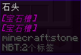

# 生成随机数量宝石槽

## 方法

```yaml
宝石槽测试:
  material: STONE
  lore:
    - '<宝石槽>'
  sections:
    宝石槽:
      type: repeat
      content: '&4&l<宝石槽>'
      # 随机1-4个
      repeat: <number::1_4_0>
      separator: "\\n"
      prefix: '"'
      postfix: '"'
```


